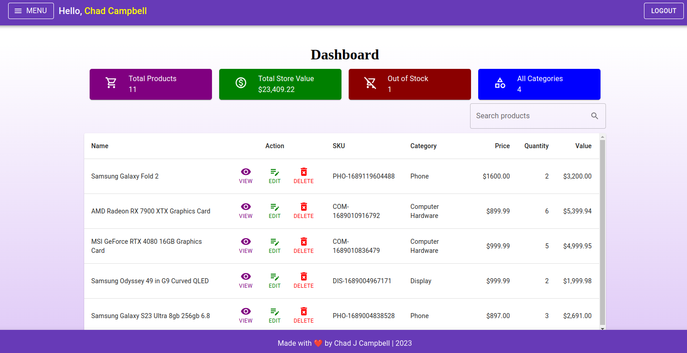
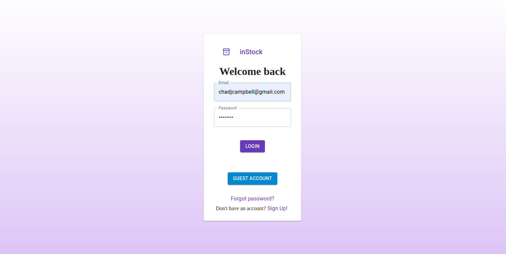
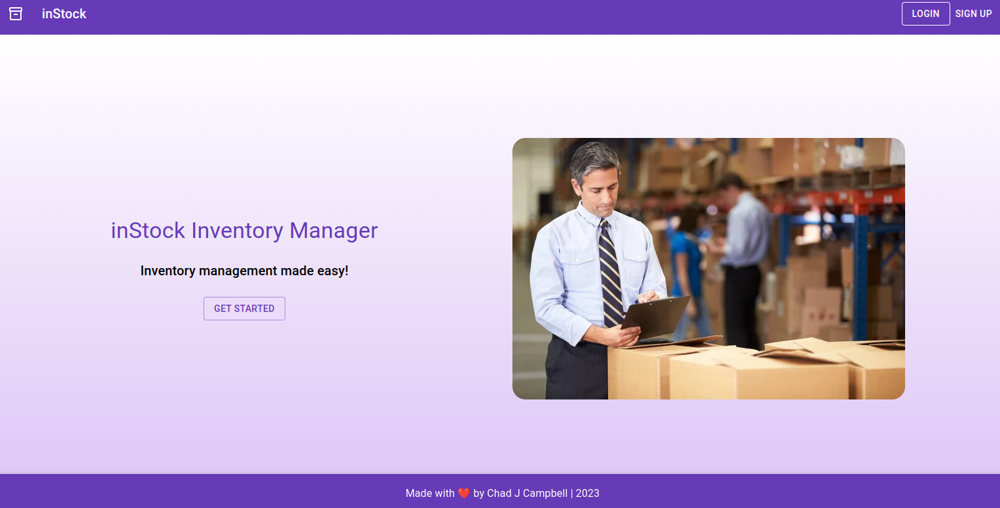
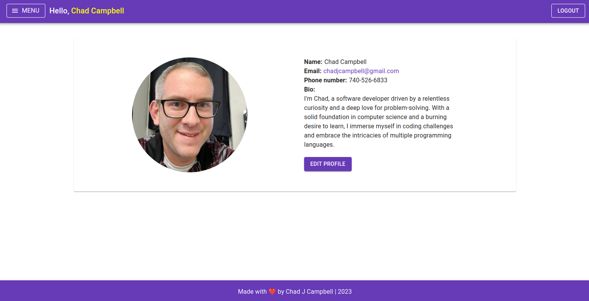

<!-- Improved compatibility of back to top link: See: https://github.com/othneildrew/Best-README-Template/pull/73 -->

<a name="readme-top"></a>

<!--
*** Thanks for checking out the Best-README-Template. If you have a suggestion
*** that would make this better, please fork the repo and create a pull request
*** or simply open an issue with the tag "enhancement".
*** Don't forget to give the project a star!
*** Thanks again! Now go create something AMAZING! :D
-->

<!-- PROJECT SHIELDS -->
<!--
*** I'm using markdown "reference style" links for readability.
*** Reference links are enclosed in brackets [ ] instead of parentheses ( ).
*** See the bottom of this document for the declaration of the reference variables
*** for contributors-url, forks-url, etc. This is an optional, concise syntax you may use.
*** https://www.markdownguide.org/basic-syntax/#reference-style-links
-->

<!-- PROJECT LOGO -->
<br />
<div align="center">
  <a href="https://github.com/chadjcampbell/inventory-manager">
    
  </a>

<h3 align="center">InStock - Inventory Manager</h3>

  <p align="center">
    <br />
    <a target='_blank' href="https://instock-three.vercel.app/"><strong>View Demo</strong></a>
    ·
    <a href="https://github.com/chadjcampbell/inventory-manager/issues">Report Bug</a>
    ·
    <a href="https://github.com/chadjcampbell/inventory-manager/issues">Request Feature</a>
  </p>
</div>

<!-- TABLE OF CONTENTS -->
<details>
  <summary>Table of Contents</summary>
  <ol>
    <li>
      <a href="#about-the-project">About The Project</a>
      <ul>
        <li><a href="#built-with">Built With</a></li>
      </ul>
    </li>
    <li>
      <a href="#getting-started">Getting Started</a>
      <ul>
        <li><a href="#installation">Installation</a></li>
      </ul>
    </li>
    <li><a href="#features">Features</a></li>
    <li><a href="#roadmap">Roadmap</a></li>
    <li><a href="#contributing">Contributing</a></li>
    <li><a href="#contact">Contact</a></li>
  </ol>
</details>

<!-- ABOUT THE PROJECT -->

## About The Project

<div align="center">
    
</div>
InStock is a MERN stack inventory management system. It has user and product management, with all the relationsships and CRUD operations you would expect for both. More technical information can be found below under the features tag.

<p align="right">(<a href="#readme-top">back to top</a>)</p>

### Built With

- [![React][react.js]][react-url]
- [][typescript-url]
- [][router-url]
- [][redux-url]
- [][mui-url]
- [][vite-url]
- [][node-url]
- [][express-url]
- [][mongo-url]
- [][mongoose-url]

<p align="right">(<a href="#readme-top">back to top</a>)</p>

<!-- GETTING STARTED -->

## Getting Started

To get a local copy up and running follow these simple example steps.

### Installation

1. Clone the repo
   ```sh
   git clone https://github.com/chadjcampbell/inventory-manager.git
   ```
2. CD into client

   ```sh
   cd client
   ```

3. Install NPM packages
   ```sh
   npm install
   ```
4. Run the client
   ```js
   npm run dev
   ```
   \*\* For full funtionality you'll need to do the same as above for the server folder, then get a Mongo atlas db and all the proper env variables

<p align="right">(<a href="#readme-top">back to top</a>)</p>

<!-- USAGE EXAMPLES -->

## Features

### User Auth

Most of the logic for user authentication is on the backend. It uses jsonWebToken, bcrypt, and the crypto node module. When users are created their password is hashed using bcrypt with a "pre-save" middleware attached to the userSchema. A token is then created with jsonWebToken and that is returned as part of the response object as a cookie. The node crypto module is used to create short lived tokens that are used to allow users to reset their passwords through a link sent via e-mail. There is also an auth middleware for protected routes that checks for a token, then matches it with a user and attaches that user to the request object. Client side the auth is fetched and distributed where needed with Redux.

### Product management

The products are structured with a ref as the first property that links each product to a user. That way each user only has access to their own products. Images are handled with cloudinary, and the rest of the data is validated with the express-validator library.

<div align="center">
    
    
    
</div>

<p align="right">(<a href="#readme-top">back to top</a>)</p>

<!-- ROADMAP -->

## Roadmap

- [ ] Add tests
- [ ] Maybe some pretty charts for product data

<p align="right">(<a href="#readme-top">back to top</a>)</p>

<!-- CONTRIBUTING -->

## Contributing

Contributions are what make the open source community such an amazing place to learn, inspire, and create. Any contributions you make are **greatly appreciated**.

If you have a suggestion that would make this better, please fork the repo and create a pull request. You can also simply open an issue with the tag "enhancement".
Don't forget to give the project a star! Thanks again!

1. Fork the Project
2. Create your Feature Branch (`git checkout -b feature/AmazingFeature`)
3. Commit your Changes (`git commit -m 'Add some AmazingFeature'`)
4. Push to the Branch (`git push origin feature/AmazingFeature`)
5. Open a Pull Request

<p align="right">(<a href="#readme-top">back to top</a>)</p>

<!-- CONTACT -->

## Contact

Email: chadjcampbell@gmail.com

<p align="right">(<a href="#readme-top">back to top</a>)</p>

<!-- MARKDOWN LINKS & IMAGES -->
<!-- https://www.markdownguide.org/basic-syntax/#reference-style-links -->

[linkedin-shield]: https://img.shields.io/badge/-LinkedIn-black.svg?style=for-the-badge&logo=linkedin&colorB=555
[linkedin-url]: https://linkedin.com/in/linkedin_username
[react.js]: https://img.shields.io/badge/React-20232A?style=for-the-badge&logo=react&logoColor=61DAFB
[react-url]: https://reactjs.org/
[bootstrap.com]: https://img.shields.io/badge/Bootstrap-563D7C?style=for-the-badge&logo=bootstrap&logoColor=white
[bootstrap-url]: https://getbootstrap.com
[framer-url]: (https://www.framer.com/motion/)
[typescript-url]: (https://www.typescriptlang.org/)
[router-url]: (https://reactrouter.com/en/main)
[jest-url]: (https://jestjs.io/)
[testing-url]: (https://testing-library.com/)
[chakra-url]: (https://chakra-ui.com/)
[vite-url]: (https://vitejs.dev/)
[firebase-url]: (https://firebase.google.com/)
[vitest-url]: (https://vitest.dev/)
[testing-libray-url]: (https://testing-library.com/)
[mui-url]: (https://mui.com/material-ui/getting-started/)
[node-url]: (https://nodejs.org/en/docs)
[express-url]: (https://expressjs.com/)
[mongo-url]: (https://www.mongodb.com/docs/)
[mongoose-url]: (https://mongoosejs.com/docs/)
[redux-url]: (https://redux-toolkit.js.org/introduction/getting-started)
